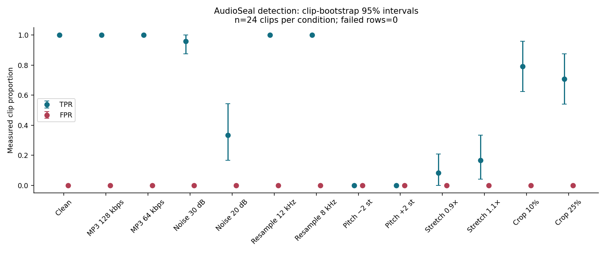
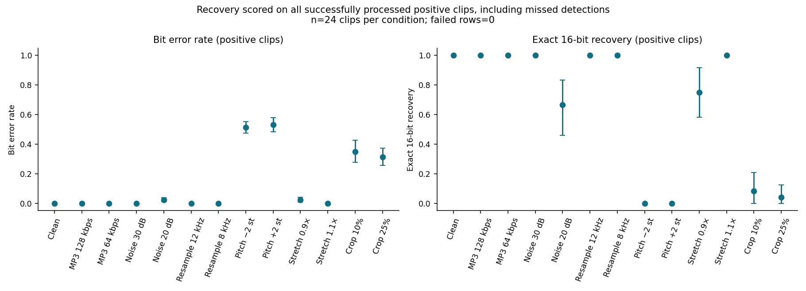
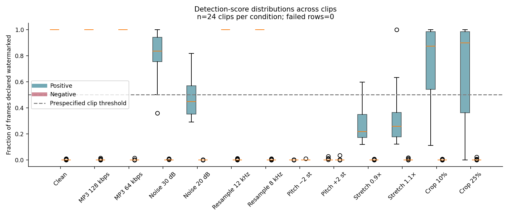
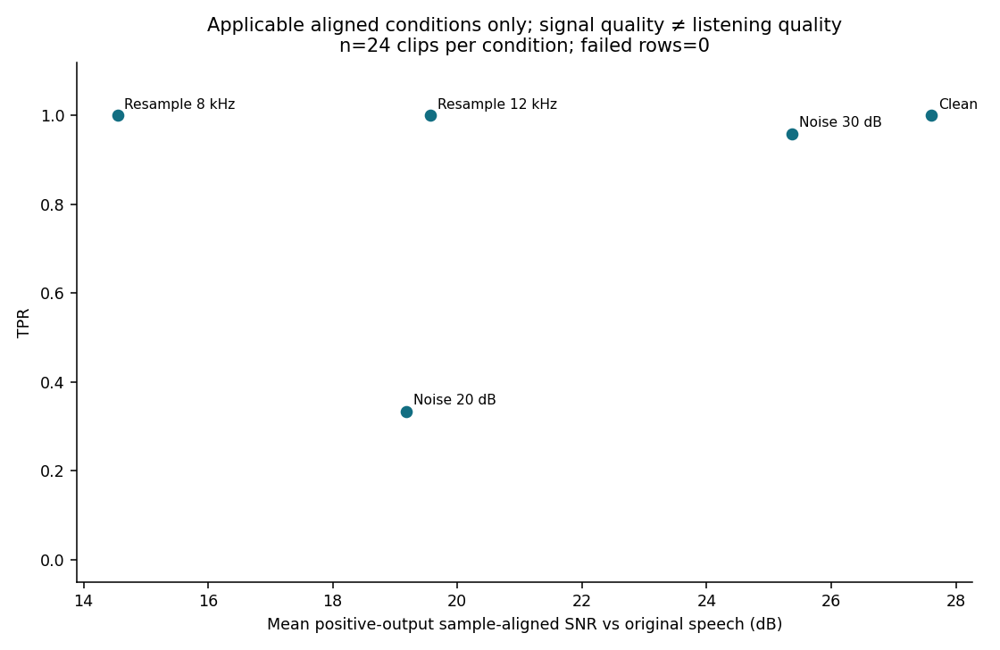

# Preliminary AudioSeal robustness evaluation

This reproducible baseline evaluates one official pretrained AudioSeal generator/detector pair on 24 public speech clips from 12 speakers. It is a small, controlled inference experiment, with no training or fine-tuning. It does not establish general audio-watermarking robustness, security, or perceptual transparency.

## Results at a glance

Clean TPR was 100.0% [100.0%, 100.0%]; FPR was 0.0% [0.0%, 0.0%]. Clean BER was 0.0% [0.0%, 0.0%] and exact 16-bit recovery was 100.0% [100.0%, 100.0%] (very preliminary results - larger corpus needed to really test it out). Among tested transformations, the lowest measured TPR was 0.0% for Pitch −2 st (BER 51.3%, exact recovery 0.0%). Ties are visible in the full table. A total of 0 of 624 attempted branch-condition rows failed. Rates below use successfully measured clips; attempted counts, missing metric counts, failed-positive-as-missed TPR, and negative-failure FPR bounds appear in the CSV.

## Sources and relation to prior work

The AudioSeal paper and official repository define the evaluated system. The supplied SoK frames broader robustness evaluation. The requested 2026 DeepMark paper's identity was verified through its official repository, whose documentation informed modular attack design, matched controls, and alignment cautions; the 2026 article's full text was unavailable. This project evaluates its own small prespecified subset and does not reproduce those papers' experimental claims. Source-specific access failures and verification notes are in [source_notes.md](source_notes.md).

[AudioSeal paper](https://proceedings.mlr.press/v235/san-roman24a.html); [official implementation](https://github.com/facebookresearch/audioseal); [robustness framing](https://arxiv.org/abs/2503.19176); [benchmark design reference](https://doi.org/10.1109/ACCESS.2026.3685903).

## Data, model, and experimental design

- Data: test-clean; 24 clips and 12 speakers, with observed durations 2.09–9.81 seconds and 107.49 seconds total. Inputs are mono 16 kHz. Selection and expected 16-bit messages are recorded in the manifest; prepared-file hashes allow content checks.
- Model: official `audioseal==0.2.0`, generator `audioseal_wm_16bits`, detector `audioseal_detector_16bits`, official pretrained checkpoints. Exact environment and checkpoint hashes are retained in project outputs. No substitute model, training, or fine-tuning was used.
- Seed: 20260905. Every clip has a deterministic 16-bit payload. The positive branch receives an additive watermark at strength 1; its matched negative branch receives no watermark. Both receive the same configured transformation and deterministic attack seed for that clip and condition.
- Conditions: clean; MP3 128/64 kbps; Gaussian noise at 30/20 dB target SNR; downsample/upsample through 12/8 kHz; pitch ±2 semitones; librosa time-stretch rates 0.9/1.1 (output duration approximately input duration divided by rate); and removal of 10%/25% of duration by deterministic cropping. Exact mechanics and attack diagnostics are retained in raw `attack_metadata`; settings are in `configs/attacks.yaml`.
- The official detector yields frame probabilities and message probabilities. A frame is positive when its watermark probability exceeds 0.5. The clip score is the fraction of positive frames. This study prespecifies clip detection as score > 0.5; this clip decision is not asserted to be an officially calibrated deployment default. Thresholds were not selected using these evaluation outcomes.
- The official example-audio smoke test gated the dataset download. A two-clip pilot covered all conditions before the full run; pilot and smoke artifacts are retained separately.

The following configuration and software values come from saved run/environment evidence, rather than the current shell or unrecorded defaults. The complete dependency list and provenance remain in `outputs/environment.json`.

| Recorded item | Value |
|---|---|
| Python | 3.11.16 (main, Sep  1 2026, 14:18:37) [Clang 22.1.3 ] |
| Host / CPU | Linux-5.15.0-67-generic-x86_64-with-glibc2.31; AMD Ryzen Threadripper PRO 5975WX 32-Cores; 64 logical CPUs |
| Execution | device=cpu; torch_threads=4; CUDA available=False; deterministic_algorithms=True; torch_compile_disabled=True |
| Core software | audioseal==0.2.0; torch==2.5.1+cpu; torchaudio==2.5.1+cpu; numpy==1.26.4; scipy==1.15.2; librosa==0.11.0; soundfile==0.13.1; pystoi==0.4.1 |
| FFmpeg | ffmpeg version 7.0.2-static https://johnvansickle.com/ffmpeg/  Copyright (c) 2000-2024 the FFmpeg developers |
| Generator / detector | audioseal_wm_16bits / audioseal_detector_16bits |
| Embedding / payload | strength=1.0; 16 bits; seed=20260905 |
| Checkpoint revision | 3c19eba53390776cf2cc9ed5f6c9ac67ce72ecba |
| Generator SHA-256 | 7a845b5fbe9364a63a3909d8ab3fe064d13a76ae4c2e983573e08c69b7b51748 |
| Detector SHA-256 | 8a78e8a83584113523e161fc599fcab10fd0e94c04d2eb9d2fa1e9ec91ab69d9 |
| Dependency-lock SHA-256 | 174b4fa6782f170967f54a03c7401f92a4e3794668944d406320166003788fa7 |

| Condition | Recorded parameters | Operation / quality applicability |
|---|---|---|
| Clean | none | Identity; no post-processing other than the common range policy. |
| MP3 128 kbps | bitrate_kbps=128 | FFmpeg libmp3lame encode/decode at 16 kHz; codec delay not independently aligned; SNR/STOI NA. |
| MP3 64 kbps | bitrate_kbps=64 | FFmpeg libmp3lame encode/decode at 16 kHz; codec delay not independently aligned; SNR/STOI NA. |
| Noise 30 dB | snr_db=30 | One seeded standard-normal draw; scaled separately to each branch's RMS for target SNR before limiting. |
| Noise 20 dB | snr_db=20 | One seeded standard-normal draw; scaled separately to each branch's RMS for target SNR before limiting. |
| Resample 12 kHz | intermediate_sr=12000 | SciPy polyphase down/up sampling, Kaiser window beta=5; output trimmed to input sample count. |
| Resample 8 kHz | intermediate_sr=8000 | SciPy polyphase down/up sampling, Kaiser window beta=5; output trimmed to input sample count. |
| Pitch −2 st | semitones=-2 | librosa phase-vocoder pitch shift, 12 bins/octave, soxr_hq; default FFT=2048/hop=512; SNR/STOI NA. |
| Pitch +2 st | semitones=2 | librosa phase-vocoder pitch shift, 12 bins/octave, soxr_hq; default FFT=2048/hop=512; SNR/STOI NA. |
| Stretch 0.9× | rate=0.9 | librosa phase-vocoder stretch; default FFT=2048/hop=512; output length approximately input/rate; SNR/STOI NA. |
| Stretch 1.1× | rate=1.1 | librosa phase-vocoder stretch; default FFT=2048/hop=512; output length approximately input/rate; SNR/STOI NA. |
| Crop 10% | fraction=0.1 | Retain a contiguous round(N*(1-fraction)) window at a seeded random valid start; SNR/STOI NA. |
| Crop 25% | fraction=0.25 | Retain a contiguous round(N*(1-fraction)) window at a seeded random valid start; SNR/STOI NA. |

Every output uses the common range policy: any samples outside [−1, 1] are limited before detection, with the prelimit rate recorded separately. Matched noise branches share the same random realization, scaled to their own RMS. Cropping removes a total fraction by retaining one contiguous window; it does not remove an interior segment and concatenate the remainder. The manifest selection occurs before inference and uses only source eligibility, sorted identities, and the fixed seed.

## Metrics and uncertainty

TPR = detected positive clips / successfully measured positive clips; FNR = 1 − TPR; FPR = detected negative controls / successfully measured negative controls. Failures are explicitly reported and are not silently converted into valid detector outcomes. The summary also provides TPR with failed positives counted as misses and lower/upper possible FPR bounds for failed controls.

Bit accuracy and BER compare the recovered payload with the expected 16-bit payload for every successfully processed positive clip, including undetected ones. Exact recovery requires all 16 bits correct. Negative-control message accuracy is inapplicable because no message was embedded. Each clip contributes one scalar for each recovery metric; individual bits are never treated as independent samples.

All reported bootstrap intervals are 95% percentile intervals from 2,000 resamples with seed 20260905, resampling clips within a condition. `paired_differences.csv` resamples per-clip attack-minus-clean differences. The same clips recur across conditions, so conditions are paired and must not be pooled as independent observations. There are only 12 speakers; multiple clips per speaker violate a strict independent-clip interpretation. These intervals describe clip-level sampling uncertainty in this small selected set, may understate speaker-level uncertainty, and do not include model, dataset, threshold, or attack-selection uncertainty. No multiple-comparison significance claims are made.

Zero false positives occurred in 13 condition(s). Their empirical bootstrap intervals collapse to [0, 0]; this is not evidence that the population FPR is zero. The largest supplemental two-sided 95% Wilson upper bound for these conditions is 13.8%. Wilson bounds also assume independent clips and do not repair speaker dependence.

Watermark SNR compares original speech with its watermarked version before attack, once per clip when reported overall. Positive-output quality SNR compares the original speech with the final positive output and therefore includes both watermark and attack distortion; the matched negative comparison captures attack-only distortion. SNR is reported only when equal length and verified sample alignment make it meaningful. Pitch shifting, time stretching, cropping, and any unverified codec alignment are explicitly inapplicable for sample-aligned quality metrics. Identical aligned signals have infinite SNR; such values are counted explicitly, and their bootstrap intervals are left inapplicable. Clipping rate is the fraction of samples with absolute amplitude ≥ 1; prelimit clipping diagnostics are kept separately.

Standard STOI is included only for compatible aligned, nonempty speech when its implementation returns a valid score. PESQ/ViSQOL were not added. Objective sample error and intelligibility estimates do not establish listening quality or watermark inaudibility; no human listening study was completed. Quality SNR was populated for 120 successful positive and 120 successful negative rows, with per-condition applicability recorded in the CSV.

## Full per-condition results

Each bracketed interval is a clip-bootstrap 95% interval. Metric-specific `*_n`, `*_n_missing`, finite/infinite counts, and all attempted/successful/failed counts are available in [summary_results.csv](../outputs/summary_results.csv).

| Condition | TPR | FPR | FNR | Bit accuracy | BER | Exact 16-bit | Failed rows |
|---|---:|---:|---:|---:|---:|---:|---:|
| Clean | 100.0% [100.0%, 100.0%] | 0.0% [0.0%, 0.0%] | 0.0% [0.0%, 0.0%] | 100.0% [100.0%, 100.0%] | 0.0% [0.0%, 0.0%] | 100.0% [100.0%, 100.0%] | 0 |
| MP3 128 kbps | 100.0% [100.0%, 100.0%] | 0.0% [0.0%, 0.0%] | 0.0% [0.0%, 0.0%] | 100.0% [100.0%, 100.0%] | 0.0% [0.0%, 0.0%] | 100.0% [100.0%, 100.0%] | 0 |
| MP3 64 kbps | 100.0% [100.0%, 100.0%] | 0.0% [0.0%, 0.0%] | 0.0% [0.0%, 0.0%] | 100.0% [100.0%, 100.0%] | 0.0% [0.0%, 0.0%] | 100.0% [100.0%, 100.0%] | 0 |
| Noise 30 dB | 95.8% [87.5%, 100.0%] | 0.0% [0.0%, 0.0%] | 4.2% [0.0%, 12.5%] | 100.0% [100.0%, 100.0%] | 0.0% [0.0%, 0.0%] | 100.0% [100.0%, 100.0%] | 0 |
| Noise 20 dB | 33.3% [16.7%, 54.2%] | 0.0% [0.0%, 0.0%] | 66.7% [45.8%, 83.3%] | 97.7% [96.1%, 99.0%] | 2.3% [1.0%, 3.9%] | 66.7% [45.8%, 83.3%] | 0 |
| Resample 12 kHz | 100.0% [100.0%, 100.0%] | 0.0% [0.0%, 0.0%] | 0.0% [0.0%, 0.0%] | 100.0% [100.0%, 100.0%] | 0.0% [0.0%, 0.0%] | 100.0% [100.0%, 100.0%] | 0 |
| Resample 8 kHz | 100.0% [100.0%, 100.0%] | 0.0% [0.0%, 0.0%] | 0.0% [0.0%, 0.0%] | 100.0% [100.0%, 100.0%] | 0.0% [0.0%, 0.0%] | 100.0% [100.0%, 100.0%] | 0 |
| Pitch −2 st | 0.0% [0.0%, 0.0%] | 0.0% [0.0%, 0.0%] | 100.0% [100.0%, 100.0%] | 48.7% [44.8%, 52.6%] | 51.3% [47.4%, 55.2%] | 0.0% [0.0%, 0.0%] | 0 |
| Pitch +2 st | 0.0% [0.0%, 0.0%] | 0.0% [0.0%, 0.0%] | 100.0% [100.0%, 100.0%] | 46.9% [42.2%, 51.6%] | 53.1% [48.4%, 57.8%] | 0.0% [0.0%, 0.0%] | 0 |
| Stretch 0.9× | 8.3% [0.0%, 20.8%] | 0.0% [0.0%, 0.0%] | 91.7% [79.2%, 100.0%] | 97.7% [95.8%, 99.2%] | 2.3% [0.8%, 4.2%] | 75.0% [58.3%, 91.7%] | 0 |
| Stretch 1.1× | 16.7% [4.2%, 33.3%] | 0.0% [0.0%, 0.0%] | 83.3% [66.7%, 95.8%] | 100.0% [100.0%, 100.0%] | 0.0% [0.0%, 0.0%] | 100.0% [100.0%, 100.0%] | 0 |
| Crop 10% | 79.2% [62.5%, 95.8%] | 0.0% [0.0%, 0.0%] | 20.8% [4.2%, 37.5%] | 65.1% [57.3%, 72.4%] | 34.9% [27.6%, 42.7%] | 8.3% [0.0%, 20.8%] | 0 |
| Crop 25% | 70.8% [54.1%, 87.5%] | 0.0% [0.0%, 0.0%] | 29.2% [12.5%, 45.9%] | 68.8% [62.8%, 74.5%] | 31.2% [25.5%, 37.2%] | 4.2% [0.0%, 12.5%] | 0 |

## Quality, timing, and failure accounting

Across distinct successfully processed clips, preattack watermark SNR was 27.60 [26.32, 28.91] dB (24 clips), watermark STOI was 0.9975 [0.9966, 0.9983] (24 valid clips), and embedding runtime was 1854.79 [1229.58, 2539.20] ms/clip. Values are means with clip-bootstrap 95% intervals. The maximum successful-output clipping fraction was 0.0%. Clipping, duration, and runtime are tabulated separately for both branches in the summary CSV.

Embedding median 1427.65 ms/clip (24 distinct positive clips); detection median 64.52 ms per successful branch-condition inference. Per-row embedding/detection timing excludes model loading, tensor preparation and the dedicated model warmup. Attack timing includes codec I/O and first library imports; cache effects and fixed positive-before-negative order can affect timing. Quality calculations and example-file writes contribute only to total run wall time. These are host-specific measurements, not a cross-hardware benchmark.

The following tables show means [95% clip-bootstrap interval]; NA marks an inapplicable or unavailable metric, and infinite clean-control SNR has no finite interval. Means of attack/runtime measurements include first-use import costs where they occurred. Per-metric denominators and negative-branch STOI, clipping, and duration also appear in the CSV.

| Condition | Positive SNR (dB) | Negative SNR (dB) | Positive STOI | Positive duration (s) | Positive clipping |
|---|---:|---:|---:|---:|---:|
| Clean | 27.60 [26.32, 28.91] | ∞ [NA, NA] | 0.998 [0.997, 0.998] | 4.479 [3.787, 5.210] | 0.0% [0.0%, 0.0%] |
| MP3 128 kbps | NA [NA, NA] | NA [NA, NA] | NA [NA, NA] | 4.479 [3.787, 5.210] | 0.0% [0.0%, 0.0%] |
| MP3 64 kbps | NA [NA, NA] | NA [NA, NA] | NA [NA, NA] | 4.479 [3.787, 5.210] | 0.0% [0.0%, 0.0%] |
| Noise 30 dB | 25.37 [24.58, 26.15] | 30.00 [30.00, 30.00] | 0.987 [0.981, 0.993] | 4.479 [3.787, 5.210] | 0.0% [0.0%, 0.0%] |
| Noise 20 dB | 19.18 [18.97, 19.37] | 20.00 [20.00, 20.00] | 0.960 [0.945, 0.974] | 4.479 [3.787, 5.210] | 0.0% [0.0%, 0.0%] |
| Resample 12 kHz | 19.57 [17.53, 21.36] | 20.73 [18.56, 22.80] | 0.998 [0.997, 0.998] | 4.479 [3.787, 5.210] | 0.0% [0.0%, 0.0%] |
| Resample 8 kHz | 14.55 [12.38, 16.61] | 14.91 [12.66, 17.11] | 0.996 [0.995, 0.997] | 4.479 [3.787, 5.210] | 0.0% [0.0%, 0.0%] |
| Pitch −2 st | NA [NA, NA] | NA [NA, NA] | NA [NA, NA] | 4.479 [3.787, 5.210] | 0.0% [0.0%, 0.0%] |
| Pitch +2 st | NA [NA, NA] | NA [NA, NA] | NA [NA, NA] | 4.479 [3.787, 5.210] | 0.0% [0.0%, 0.0%] |
| Stretch 0.9× | NA [NA, NA] | NA [NA, NA] | NA [NA, NA] | 4.976 [4.207, 5.789] | 0.0% [0.0%, 0.0%] |
| Stretch 1.1× | NA [NA, NA] | NA [NA, NA] | NA [NA, NA] | 4.072 [3.442, 4.737] | 0.0% [0.0%, 0.0%] |
| Crop 10% | NA [NA, NA] | NA [NA, NA] | NA [NA, NA] | 4.031 [3.408, 4.689] | 0.0% [0.0%, 0.0%] |
| Crop 25% | NA [NA, NA] | NA [NA, NA] | NA [NA, NA] | 3.359 [2.840, 3.908] | 0.0% [0.0%, 0.0%] |

| Condition | Positive attack (ms) | Negative attack (ms) | Positive detection (ms) | Negative detection (ms) |
|---|---:|---:|---:|---:|
| Clean | 0.33 [0.29, 0.38] | 0.30 [0.27, 0.35] | 102.60 [79.56, 127.77] | 68.31 [58.12, 80.70] |
| MP3 128 kbps | 20.92 [19.09, 22.81] | 22.52 [20.43, 24.51] | 68.32 [58.76, 79.49] | 69.39 [60.12, 80.36] |
| MP3 64 kbps | 21.35 [19.19, 23.62] | 22.26 [20.27, 24.22] | 69.15 [59.68, 80.21] | 68.97 [59.02, 80.08] |
| Noise 30 dB | 1.66 [1.45, 1.88] | 1.54 [1.33, 1.76] | 66.68 [57.21, 78.02] | 68.13 [58.10, 80.01] |
| Noise 20 dB | 1.54 [1.33, 1.76] | 1.53 [1.32, 1.74] | 67.53 [57.79, 79.23] | 67.66 [57.85, 79.53] |
| Resample 12 kHz | 2.42 [2.09, 2.80] | 2.38 [2.06, 2.71] | 67.99 [58.07, 79.78] | 67.61 [57.76, 79.38] |
| Resample 8 kHz | 2.36 [2.06, 2.68] | 2.35 [2.04, 2.66] | 67.51 [57.77, 79.07] | 67.54 [57.82, 79.13] |
| Pitch −2 st | 62.98 [14.21, 158.16] | 16.33 [14.08, 18.70] | 67.12 [57.68, 78.41] | 67.51 [57.85, 79.01] |
| Pitch +2 st | 18.98 [16.29, 21.73] | 19.07 [16.46, 21.87] | 67.77 [58.25, 79.14] | 67.11 [57.84, 78.24] |
| Stretch 0.9× | 17.81 [15.30, 20.45] | 17.81 [15.28, 20.42] | 117.00 [95.81, 139.01] | 74.69 [62.91, 88.55] |
| Stretch 1.1× | 15.22 [13.20, 17.40] | 15.38 [13.17, 17.77] | 98.43 [77.36, 120.18] | 62.86 [54.03, 73.78] |
| Crop 10% | 0.34 [0.31, 0.36] | 0.34 [0.31, 0.37] | 89.15 [72.36, 106.94] | 59.69 [51.02, 70.35] |
| Crop 25% | 0.33 [0.30, 0.36] | 0.32 [0.30, 0.35] | 78.65 [61.54, 98.03] | 51.23 [44.39, 58.71] |

There were 0 failed inference/attack rows. [failures.csv](../outputs/failures.csv) retains every failed row and its error message, including an empty header-only file if none failed. Setup, download, test, and other command failures are recorded in `STATUS.md` and `outputs/logs/`; absence of failed inference rows does not imply that every setup command succeeded. See those records for exact commands and resolutions.

The first official-example smoke attempt failed in PyTorch's optional Inductor compilation with `ModuleNotFoundError: No module named 'setuptools'`. The recorded environment includes `setuptools==75.8.0` and `torch_compile_disabled=True`. The successful retry used the official model's eager inference path with `TORCHDYNAMO_DISABLE=1`; the official AudioSeal implementation and checkpoints were not substituted. The original failure and traceback are retained in [smoke_test_failed_01.json](../outputs/smoke_test_failed_01.json).

## Interpretation and limits

Presence detection and payload recovery differed: Stretch 1.1× had TPR 16.7% and exact message recovery 100.0%; Crop 25% had TPR 70.8% and exact message recovery 4.2%. These endpoints should not be used interchangeably.

Among tested transformations, the lowest measured TPR was 0.0% for Pitch −2 st (BER 51.3%, exact recovery 0.0%). Ties are visible in the full table. Differences are descriptive and specific to this speech subset, checkpoint pair, decision threshold, and implemented attack settings. Potential explanations involving codec suppression, resampling bandwidth, pitch/frequency changes, temporal warping, or loss of watermark-bearing segments are hypotheses, not identified mechanisms. Matched controls estimate false positives under the same transformations but cannot characterize rare false positives from 24 controls per condition or a general population. Overlapping conditions reuse the same clips, so 13 conditions do not create 13 independent control datasets.

The deterministic selection is not a random sample of all speech. Audiobook speech excludes many languages, recording conditions, music, generated speech, long-form audio, replay channels, adaptive attacks, compound transformations, watermark removal optimization, model shifts, and training-time attacks. This evaluation does not assess adversarial security. Before operational use, a larger speaker-disjoint evaluation, threshold calibration on separate data, broader audio coverage, perceptual listening, and targeted threat-model testing would be needed.

## Reproducibility and audit trail

- Raw input: `outputs/raw_results.csv`; SHA-256 `004acea9ed531fa9ea5f40d17ade380c5b0c7e656454df50eef8fce67a225d41`.
- Run ID: `20260905T233538.930635Z`; recorded raw Git commit(s): `b4f3de4a4f74b8742b201c9e0941cfe5166082fc`.
- Grid: 24 clips × 13 conditions × 2 matched branches = 624 rows. All measurement summary tables and figures were generated from raw per-clip rows, with no manual adjustment of measurements; setup and configuration tables use saved provenance.
- Environment: [`outputs/environment.json`](../outputs/environment.json), resolved dependency lock and provenance records. Environment file was present when the report was generated; it is the authoritative hardware/software record.
- Dataset composition: [dataset_composition.csv](../outputs/dataset_composition.csv); paired contrasts: [paired_differences.csv](../outputs/paired_differences.csv); aggregation metadata: [aggregation_metadata.json](../outputs/aggregation_metadata.json).
- Recreate aggregates with `.venv/bin/python scripts/generate_report.py --raw outputs/raw_results.csv --output-dir outputs/reproduced_summary --reports-dir reports/reproduced --resamples 2000`. Output directories must not contain existing generated artifacts.
- Complete run and test commands are in `README.md` and `STATUS.md`. Reproducibility checks compare deterministic messages, attack outputs, and scientific metrics; measured wall-clock runtime is expected to vary.

Validation evidence available when these artifacts were generated is summarized below. Final claims review may follow report creation; its authoritative record is retained separately in `outputs/claims_audit.json` and `STATUS.md`.

| Validation stage | Recorded result | Artifact |
|---|---|---|
| Official smoke retry | status=passed | [smoke_test.json](../outputs/smoke_test.json) |
| Pilot inspection | status=passed; actual_rows=52; expected_rows=52; failed_rows=0 | [inspection.json](../outputs/pilot/inspection.json) |
| Raw run validation | status=passed; actual_rows=624; expected_rows=624; failed_rows=0 | [validation.json](../outputs/validation.json) |
| Final test suite | status=passed; tests_passed=110; tests_failed=0; summary=Full suite; upstream matplotlib/pyparsing deprecation warnings retained in log. Dependency check passed. | [final_validation.json](../outputs/final_validation.json) |
| Reproducibility audit | status=passed | [reproducibility_audit.json](../outputs/reproducibility_audit.json) |
| Claims audit | not present at generation; consult the final STATUS.md audit record | — |
